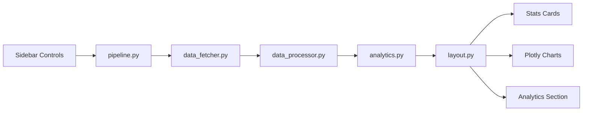
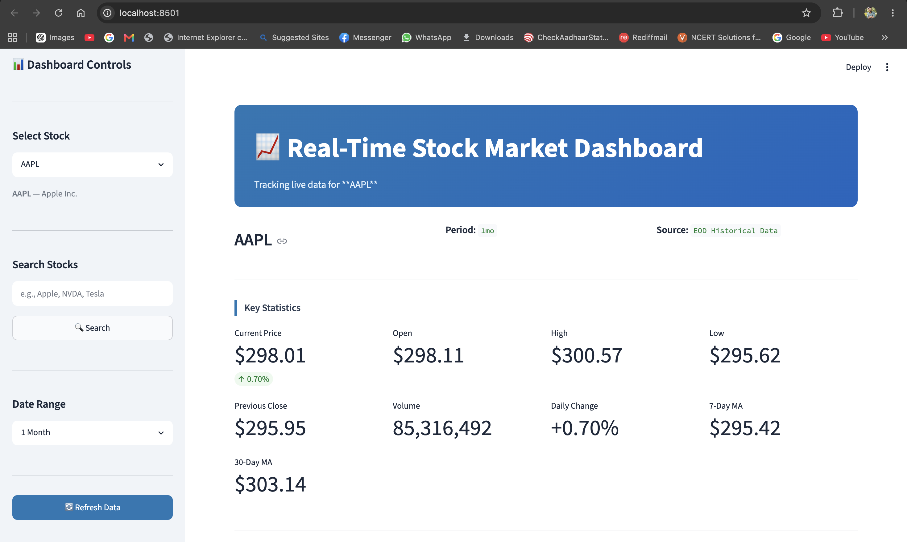
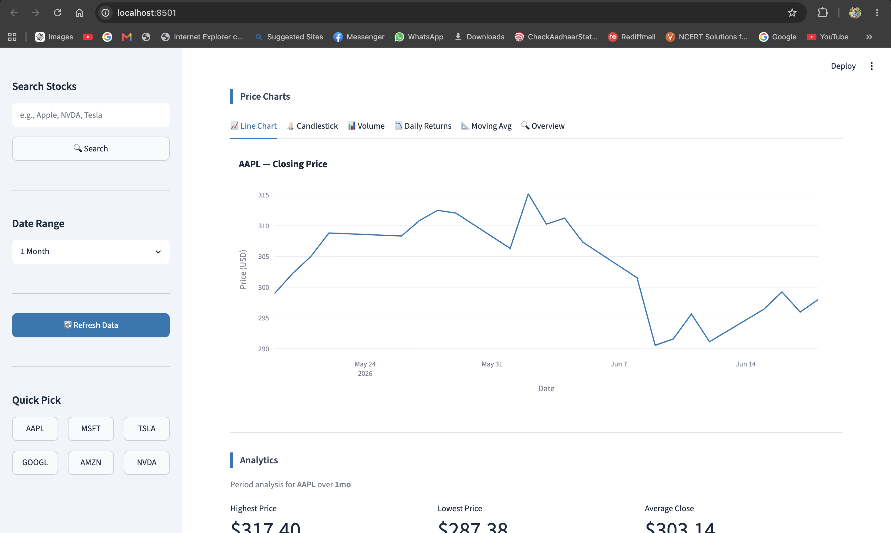
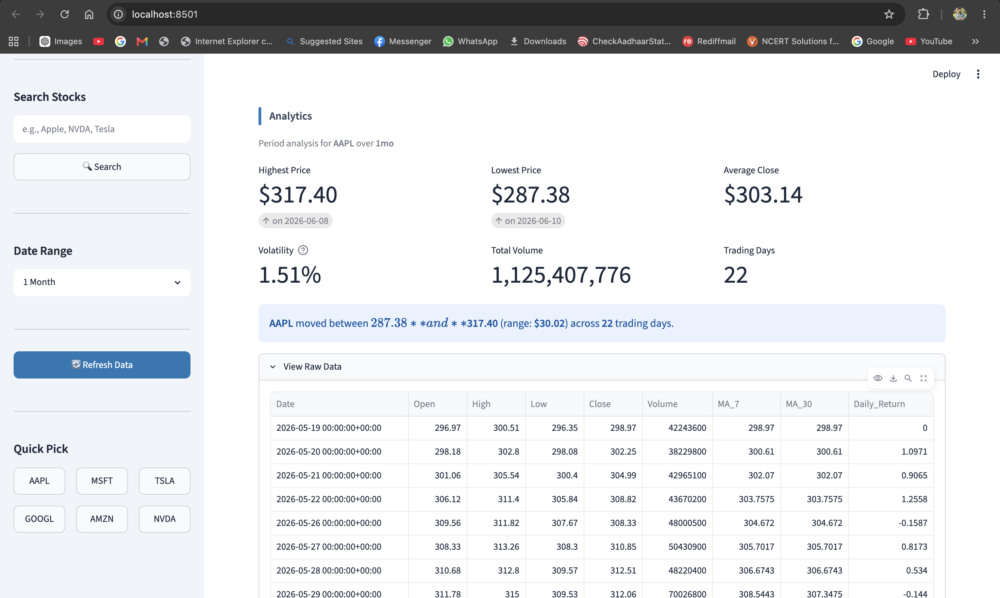
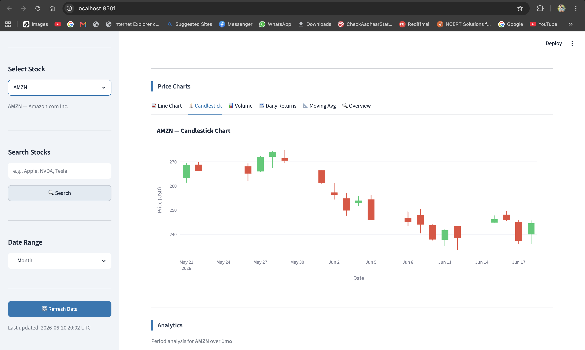
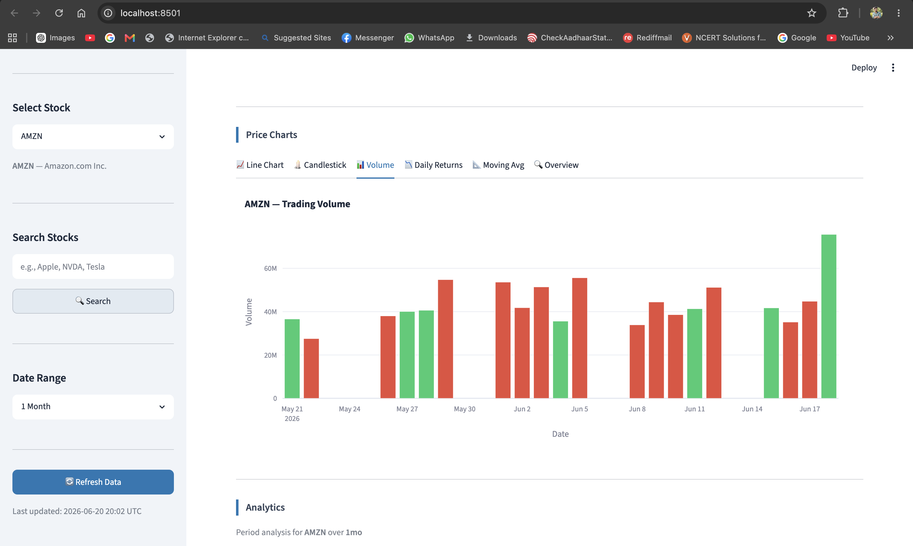
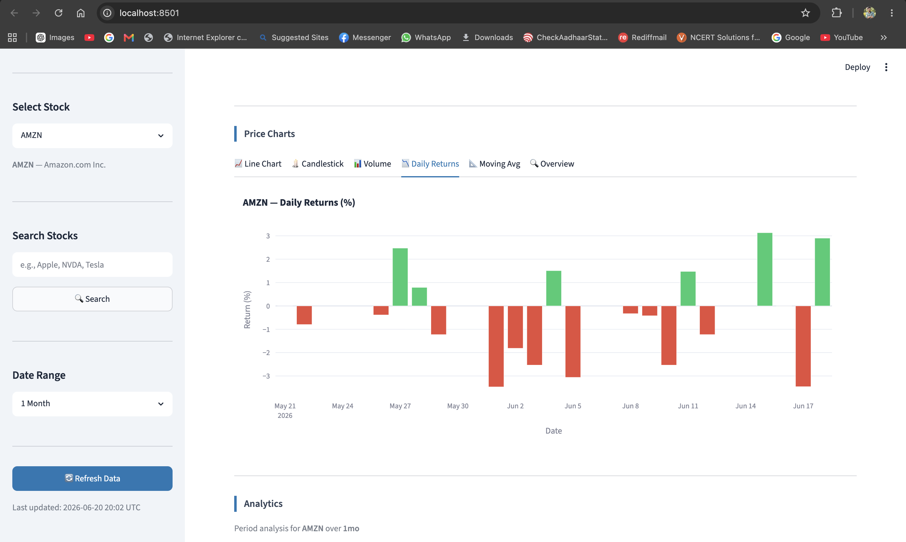
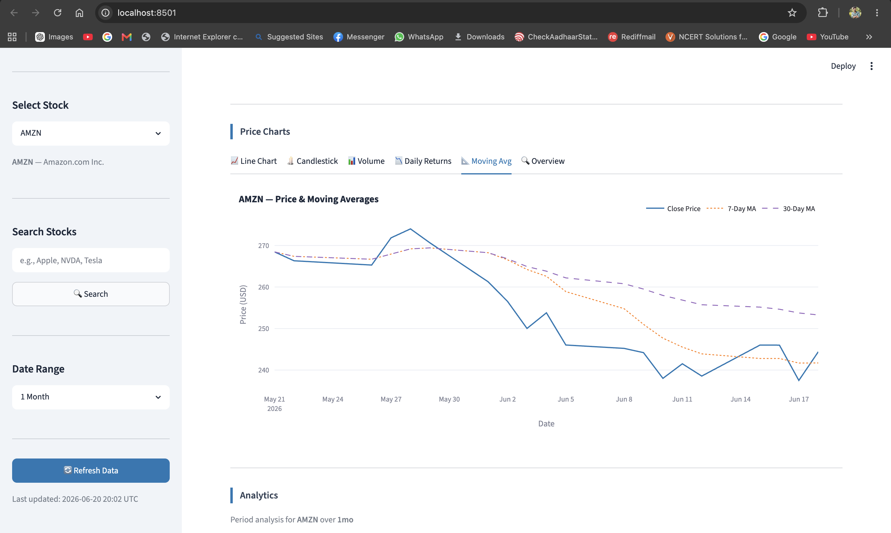
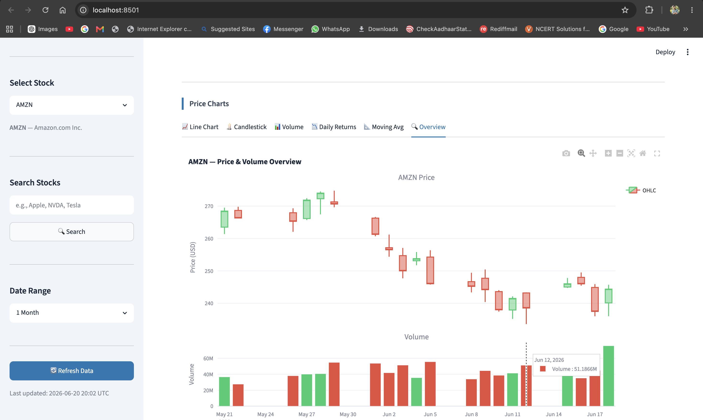

# Real-Time Stock Market Dashboard

A professional Python internship portfolio project that tracks and visualizes live stock market data using **Python**, **Pandas**, **Requests**, **Plotly**, and **Streamlit**.


---

## Features

| Area | What it does |
|------|----------------|
| **Live data** | Fetches near real-time stock quotes and history from public APIs |
| **Stock search** | Dropdown, search box, and Quick Pick buttons for common symbols |
| **Date ranges** | 1 Day through All Time — updates all dashboard sections |
| **Statistics** | 9 live indicator cards (price, volume, moving averages, daily change) |
| **Charts** | 6 interactive Plotly tabs (line, candlestick, volume, returns, MA, overview) |
| **Analytics** | Period metrics — highest/lowest price, average close, volatility, total volume |
| **Error handling** | User-friendly messages for invalid symbols, API failures, and empty data |

### Default stocks

`AAPL` · `MSFT` · `TSLA` · `GOOGL` · `AMZN` · `NVDA`

---

## Tech Stack

| Category | Technology |
|----------|------------|
| Language | Python 3.10+ |
| Data Processing | Pandas |
| API Requests | Requests + curl_cffi (Yahoo fallback) |
| Visualization | Plotly |
| Web App | Streamlit |

---

## Architecture



**Data flow:** Sidebar filters → unified pipeline → fetch → process → analyze → render UI.

---

## Project Status

| Module | Description | Status |
|--------|-------------|--------|
| 1 | Project Setup | ✅ Complete |
| 2 | Stock Data Fetching | ✅ Complete |
| 3 | Data Processing | ✅ Complete |
| 4 | Dashboard UI | ✅ Complete |
| 5 | Plotly Visualizations | ✅ Complete |
| 6 | Analytics Section | ✅ Complete |
| 7 | Final Integration | ✅ Complete |
| 8 | Deployment & Documentation | ✅ Complete |

---

## Final Project Structure

```
stock-market-dashboard/
├── app.py                          # Main Streamlit entry point
├── requirements.txt                # Python dependencies
├── runtime.txt                     # Python version for Streamlit Cloud
├── README.md                       # Project documentation (this file)
├── .gitignore
├── .streamlit/
│   └── config.toml                 # Streamlit theme & server settings
├── config/
│   ├── __init__.py
│   └── settings.py                 # API URLs, defaults, constants
├── src/
│   ├── __init__.py
│   ├── data_fetcher.py             # Module 2 — API data fetching
│   ├── data_processor.py           # Module 3 — Pandas processing
│   ├── analytics.py                # Module 6 — Period analytics
│   ├── pipeline.py                 # Module 7 — Unified integration pipeline
│   ├── exceptions.py               # Custom error types
│   └── ui/                         # Module 4/5 — Dashboard UI & charts
│       ├── __init__.py
│       ├── layout.py               # Main orchestrator
│       ├── sidebar.py              # Filters, search, quick pick
│       ├── header.py               # Dashboard header banner
│       ├── stats_cards.py          # Statistics metric cards
│       ├── analytics_cards.py      # Analytics section
│       ├── charts.py               # Plotly chart builders
│       ├── chart_renderer.py       # Chart tab renderer
│       ├── formatters.py           # Number/date formatting helpers
│       └── styles.py               # Custom CSS
├── scripts/
│   ├── test_module2.py … test_module8.py
└── docs/
    └── screenshots/                # Place portfolio screenshots here
        └── .gitkeep
```

---

## Prerequisites

- **Python 3.10 or higher**
- **pip** (Python package manager)
- **Internet connection** (for API data and package install)
- **Git** (optional — for GitHub upload)

Check your Python version:

```bash
python3 --version
```

---

## Installation Guide

### Step 1: Get the project

**Option A — Already on your machine:**

```bash
cd stock-market-dashboard
```

**Option B — Clone from GitHub (after you upload):**

```bash
git clone https://github.com/YOUR_USERNAME/stock-market-dashboard.git
cd stock-market-dashboard
```

### Step 2: Create a virtual environment

**macOS / Linux:**

```bash
python3 -m venv venv
source venv/bin/activate
```

**Windows (Command Prompt):**

```cmd
python -m venv venv
venv\Scripts\activate
```

**Windows (PowerShell):**

```powershell
python -m venv venv
venv\Scripts\Activate.ps1
```

You should see `(venv)` at the start of your terminal prompt.

### Step 3: Install dependencies

```bash
pip install -r requirements.txt
```

### Step 4 (Optional): Set a custom EOD API token

The app works out of the box with the free EOD `demo` token. For higher rate limits, get a free key at [eodhistoricaldata.com](https://eodhistoricaldata.com/) and set:

```bash
export EOD_API_TOKEN="your_token_here"    # macOS / Linux
set EOD_API_TOKEN=your_token_here         # Windows CMD
```

---

## Execution Guide

### Run the dashboard

```bash
streamlit run app.py
```

- Browser opens at **http://localhost:8501**
- On first run, Streamlit may ask for an email — press **Enter** to skip
- Stop the server with **Ctrl + C**

### Run all module tests

```bash
python scripts/test_module2.py
python scripts/test_module3.py
python scripts/test_module4.py
python scripts/test_module5.py
python scripts/test_module6.py
python scripts/test_module7.py
python scripts/test_module8.py
```

### Quick verification checklist

1. **Sidebar** — dropdown, search, date range, refresh, and Quick Pick all work
2. **Header** — shows the active stock symbol
3. **Statistics** — 9 live indicator cards update
4. **Charts** — 6 interactive Plotly tabs render
5. **Analytics** — period metrics and summary box display
6. **Raw Data** — expander shows the processed DataFrame
7. Switch between all 6 default stocks — everything updates
8. Change date range — all sections refresh
9. Test `GOOGL` and `NVDA` — full dashboard loads without errors

---

## Deployment (Streamlit Community Cloud)

Deploy for free at [share.streamlit.io](https://share.streamlit.io).

### 1. Push to GitHub

Follow the [GitHub upload instructions](#github-upload-instructions) below first.

### 2. Deploy on Streamlit Cloud

1. Sign in at [share.streamlit.io](https://share.streamlit.io) with your GitHub account
2. Click **New app**
3. Select your repository: `YOUR_USERNAME/stock-market-dashboard`
4. Set **Main file path** to: `app.py`
5. Click **Deploy**

### 3. Files used for deployment

| File | Purpose |
|------|---------|
| `app.py` | Streamlit entry point |
| `requirements.txt` | Installs Python packages |
| `runtime.txt` | Pins Python version |
| `.streamlit/config.toml` | App theme and server settings |

### 4. Optional secrets (Streamlit Cloud)

If using a custom EOD API token, add in the Streamlit Cloud dashboard under **Settings → Secrets**:

```toml
EOD_API_TOKEN = "your_token_here"
```

Then read it in `config/settings.py` via `os.getenv("EOD_API_TOKEN")` (already supported).

---

## GitHub Upload Instructions

### 1. Initialize Git (first time only)

```bash
cd stock-market-dashboard
git init
git add .
git commit -m "Initial commit: Real-Time Stock Market Dashboard"
```

### 2. Create a GitHub repository

1. Go to [github.com/new](https://github.com/new)
2. Name it `stock-market-dashboard`
3. Leave it **Public** (required for free Streamlit Cloud)
4. Do **not** add a README (you already have one)
5. Click **Create repository**

### 3. Push your code

Replace `YOUR_USERNAME` with your GitHub username:

```bash
git branch -M main
git remote add origin https://github.com/YOUR_USERNAME/stock-market-dashboard.git
git push -u origin main
```

### 4. What gets committed

The `.gitignore` excludes:

- `venv/` — virtual environment
- `__pycache__/` — Python cache
- `.env` — API keys
- `.streamlit/secrets.toml` — local secrets
- `.idea/` — IDE settings

**Never commit API keys or secrets.**

---

## Screenshots 










---

## Troubleshooting

| Problem | Solution |
|---------|----------|
| `command not found: streamlit` | Activate venv: `source venv/bin/activate` |
| `GOOGL` / `NVDA` fails | Ensure `curl_cffi` is installed: `pip install curl_cffi` |
| API rate limit (429) | Wait a few seconds and click **Refresh** |
| Empty charts | Try a longer date range (e.g., `3 Months`) |
| Port already in use | Run on another port: `streamlit run app.py --server.port 8502` |
| Module import errors | Run tests from project root, not from `scripts/` |

---

## Data Sources

| Source | Used for |
|--------|----------|
| **EOD Historical Data** | Primary API (free `demo` token) |
| **Yahoo Finance** | Fallback via `curl_cffi` (GOOGL, NVDA on demo token) |

---

## Author

Faaiz Ali - alisyedfaaiz@gmail.com

Built as a **Python Developer Internship** portfolio project.

## License

This project is for educational and portfolio purposes.
